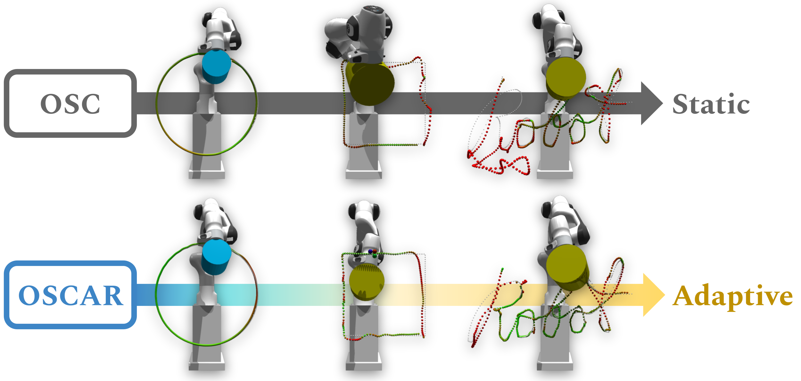

[](https://github.com/NVlabs/oscar/blob/master/LICENSE)


# OSCAR

<div align="center">
  
</div>

### [Project Page](https://cremebrule.github.io/oscar-web) | [Paper](https://arxiv.org/abs/TBD)

This repository contains the codebase used in [**OSCAR: Data-Driven Operational Space Control for Adaptive and Robust Robot Manipulation**](https://cremebrule.github.io/oscar-web).

More generally, this codebase is a modular framework built upon [IsaacGym](https://developer.nvidia.com/isaac-gym), and intended to support future robotics research leveraging large-scale training.

Of note, this repo contains:
- High-quality controller implementations of OSC, IK, and Joint-Based controllers that have been fully parallelized for PyTorch
- Complex Robot Manipulation tasks for benchmarking learning algorithms
- Modular structure enabling rapid prototyping of additional robots, controllers, and environments

## Requirements
- Linux machine
- Conda
- NVIDIA GPU + CUDA

## Getting Started
First, clone this repo and initialize the submodules:

```bash
git clone https://github.com/NVlabs/oscar.git
cd oscar
git submodule update --init --recursive
```

Next, create a new conda environment to be used for this repo and activate the repo:
```bash
bash create_conda_env_oscar.sh
conda activate oscar
```

This will create a new conda environment named `oscar` and additional install some dependencies. Next, we need IsaacGym. This repo itself does not contain IsaacGym, but is compatible with any version > preview 3.0.

Install and build IsaacGym [HERE](https://developer.nvidia.com/isaac-gym).

Once installed, navigate to the python directory and install the package to this conda environment:

```bash
(oscar) cd <ISAACGYM_REPO_PATH>/python
(oscar) pip install -e .
```

Now with IsaacGym installed, we can finally install this repo as a package:

```bash
(oscar) cd <OSCAR_REPO_PATH>
(oscar) pip install -e .
```

That's it!

## Training
Provided are helpful scripts for running training, evaluation, and finetuning. These are found in the [Examples](./examples) directory. You can set the Task, Controller, and other parameters directly at the top of the example script. They should run out of the box, like so:

```bash
cd examples
bash train.sh
```

For evaluation (including zero-shot), you can modify and run:
```bash
bash eval.sh
```

For finetuning on the published out-of-distribution task settings using a pretrained model, you can modify and run:
```bash
bash finetune.sh
```

To pretrain the initial OSCAR base network, you can modify and run:
```bash
bash pretrain_oscar.sh
```

## Reproducing Paper Results
We provide all of our final trained models used in our published results, found in [trained_models](./trained_models) section.

## License
Please check the [LICENSE](./LICENSE.txt) file. OSCAR may be used non-commercially, meaning for research or evaluation purposes only. For business inquiries, please contact researchinquiries@nvidia.com.

## Citations
Please cite [**OSCAR**](https://cremebrule.github.io/oscar-web) if you use this framework in your publications:
```bibtex
@inproceedings{wong2020oscar,
  title={OSCAR: Data-Driven Operational Space Control for Adaptive and Robust Robot Manipulation},
  author={Josiah Wong and Viktor Makoviychuk and Anima Anandkumar and Yuke Zhu},
  booktitle={arXiv preprint arXiv:TBD},
  year={2021}
}
```
